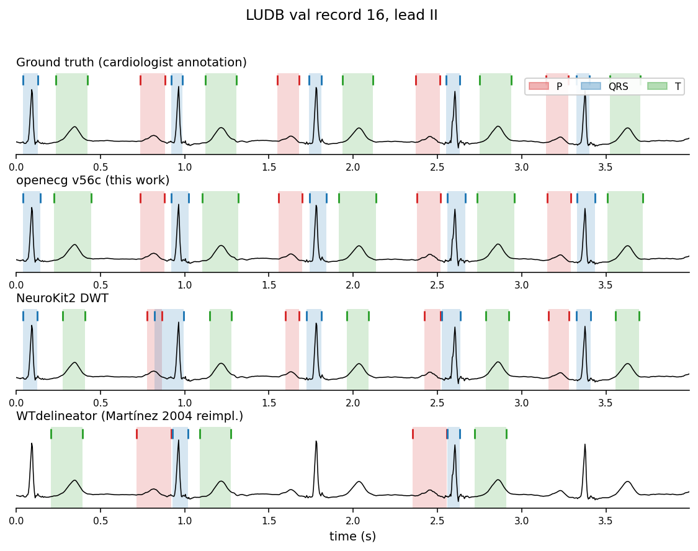
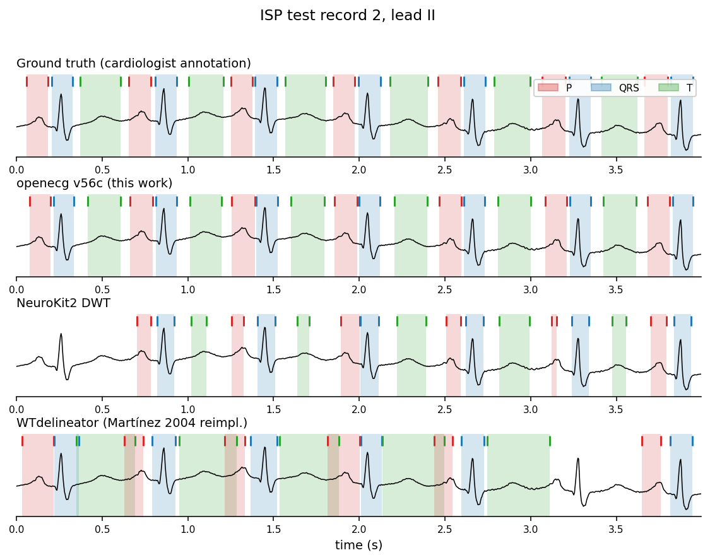
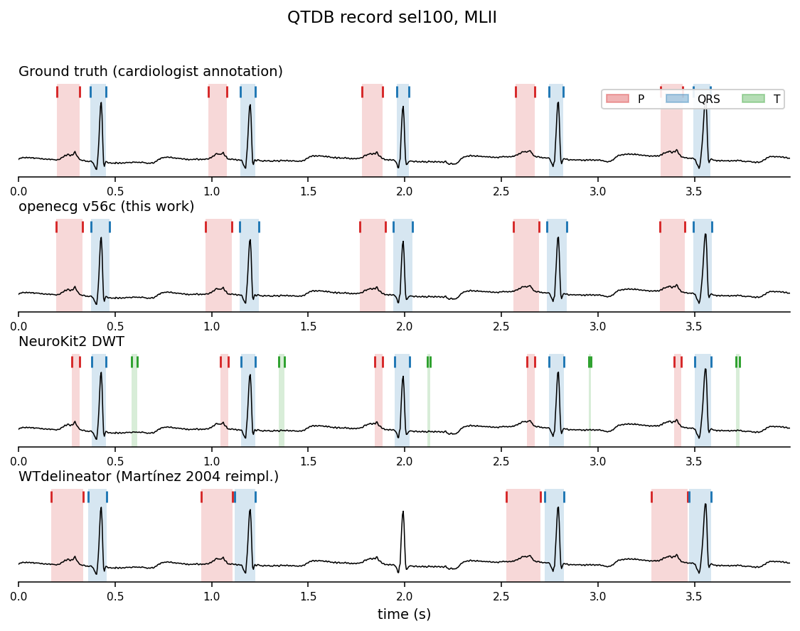

# OpenECG

*Clinically-grounded ECG wave segmentation that ships an int8 TFLite model in 1.5 MB.*

[](https://pypi.org/project/openecg/)
[](https://pypi.org/project/openecg/)
[](LICENSE)

OpenECG ships:

- A **pretrained per-frame P / QRS / T classifier** with a parallel
  boundary-regression head — 0.99 M params, trained on
  LUDB + QTDB + ISP + a synthetic AV-block mix. Beats NeuroKit2 DWT and
  WTdelineator (Martínez 2004) on every public benchmark we tested
  (see [Performance](#performance)).
- A **TFLite int8 deploy artifact** (~1.5 MB) bundled inside the wheel
  so `Inference()` works with no extra downloads — usable on Android,
  iOS, Raspberry Pi, AED-class embedded targets. Inference uses only
  `tflite-runtime` (~5 MB) + numpy; no PyTorch, no TensorFlow.
- A **13-symbol RLE token format** (`openecg.codec`, `openecg.vocab`)
  that compresses 12-lead ECGs into a clinically interpretable sequence.
- **Loaders** for LUDB, QTDB, ISP, BUT PDB, PTB-XL and the
  synthetic AV-block dataset so every number in this README is
  reproducible from a clean clone.

## Install

```bash
# Core (numpy-only): tokenizer + signal processing primitives
pip install openecg

# Inference (ships a 1.5 MB int8 TFLite model — no torch needed)
pip install "openecg[deploy]"

# Training / evaluation (loaders, stage2 transformer, optional NeuroKit2)
pip install "openecg[loaders,stage2]"
```

PyTorch is **only** required for training and for `[deploy-export]`.
The default inference path uses TFLite via `tflite-runtime`.

## Quickstart

### Boundary detection from a numpy signal

```python
import numpy as np
from openecg.deploy import Inference

# Loads the bundled v56c int8 TFLite model — no download needed.
det = Inference()

# Any 1-D float array at 250 Hz; e.g. one lead of a 10-second clip.
ecg_250hz = np.load("my_ecg.npy")                 # shape (N,) at 250 Hz

# Slides a 10-s window with no overlap; trailing samples are zero-padded.
windows = det.predict(ecg_250hz)
for w in windows:
    for b in w:
        print(b.name, b.start, b.end)             # "P 145 215", "QRS 320 365", ...
```

`b.start` / `b.end` are sample-indexed (0-based) inside the 10-s
window. Each window yields up to ~50 boundaries (P + QRS + T per beat).
The model expects **single-channel input at 250 Hz** — resample
upstream if your source is 500 / 1000 Hz.

### Tokenize a hand-built event stream

```python
from openecg import codec, vocab

events = [
    (vocab.ID_ISO, 200), (vocab.ID_P, 80),  (vocab.ID_ISO, 80),
    (vocab.ID_Q,   20),  (vocab.ID_R, 40),  (vocab.ID_S, 40),
    (vocab.ID_ISO, 120), (vocab.ID_T, 200), (vocab.ID_ISO, 220),
]
packed = codec.encode(events)                     # uint16 RLE pack
print(codec.render_compact(events))               # one char per event
print(codec.decode(packed) == events)             # round-trip
```

## Performance

The shipped model is **v56c** — `vit_transformer_noaux_1ch`, L8/d=128
(0.99 M params), trained with soft-T α=0.9 on LUDB + QTDB + ISP +
synthetic AV-block data and rank-normalised input. The exported TFLite
int8 is bit-equivalent (Δ macro-F1 = -0.0025 vs torch fp32).

Macro-F1 across the six P / QRS / T on/off boundaries, with
Martínez 2004 tolerances (P 50 ms, QRS 40 ms, T_on 50 ms, T_off 100 ms),
**lead II only**:

| Dataset (n records) | **openecg v56c** | NeuroKit2 DWT | WTdelineator |
|---|---:|---:|---:|
| LUDB val (41)          | **0.963** | 0.788 | 0.596 |
| ISP test (72)          | **0.971** | 0.703 | 0.604 |
| QTDB T-subset (44)     | **0.908** | 0.605 | 0.535 |

openecg also hits **≤16 ms median timing error on every boundary**,
meeting the clinical 20 ms spec target — the wavelet baselines miss it
on T_off (~44 ms) and on every P boundary. Full per-boundary
F1 / Se / P+ / SD / median error tables are in
[`docs/benchmarks/v56c_vs_baselines.md`](docs/benchmarks/v56c_vs_baselines.md).

### Representative cases

Each figure overlays the four detectors on the same ECG strip from each
benchmark dataset, lead II. P = red, QRS = blue, T = green; shaded
regions are the predicted wave durations, vertical ticks at the top
mark predicted onsets and offsets.

**LUDB val record 16** — clean sinus rhythm with prominent P / QRS / T;
openecg matches the cardiologist annotation, NeuroKit2 places P
boundaries off the true wave and the WTdelineator drops most P / T
detections after the first beat.



**ISP test record 2** — dense rhythm with subtle P and biphasic T;
openecg locks onto every beat, NeuroKit2 misses the first beat entirely
and shifts QRS/T positions, WTdelineator's T spans run far beyond
the true T-wave.



**QTDB record sel100 (MLII)** — low-amplitude T waves, the regime
where wavelet methods struggle. openecg keeps tight P and QRS spans
on every beat; NeuroKit2 produces sporadic T detections far from the
T wave; WTdelineator drops two of the four beats.



Reproduce these figures:

```bash
python -m scripts.viz_benchmark_v56c
# writes docs/figures/v56c_vs_baselines_{ludb,isp,qtdb}.png
```

```bash
python -m scripts.benchmark_v56c --leads ii --out out/benchmark_v56c.json
```

### Deploy footprint

| Path | Size | Macro-F1 | Latency / 10-s window |
|---|---:|---:|---:|
| Torch fp32 (training) | 4.0 MB | 0.9299 | 44 ms |
| TFLite fp32           | 4.4 MB | 0.9299 | 44 ms |
| **TFLite int8 (bundled)** | **1.5 MB** | **0.9274** | 44 ms |

We benchmarked ExecuTorch on the same checkpoint and TFLite int8 won
by 3.5× on latency and -0.004 less F1 loss — TFLite stays canonical
until ExecuTorch ships a weight-only int8 recipe. See
[`docs/benchmarks/v56c_vs_baselines.md`](docs/benchmarks/v56c_vs_baselines.md)
for the full backend comparison.

## Optional extras

`pyproject.toml` declares optional dependency groups so each install is
minimal:

- `[deploy]` — `tflite-runtime` + `numpy`; what end users install. Pulls
  the bundled `.tflite` model from the wheel; no PyTorch needed.
- `[loaders]` — `wfdb` + `scipy` for LUDB / ISP / QTDB / BUT PDB / PTB-XL.
- `[stage2]` — torch + transformers for the training-time backbones.
- `[delineate]` — NeuroKit2 + scipy for the baseline comparison.
- `[deploy-export]` — torch + ai-edge-torch for re-exporting the
  `.tflite` from a torch checkpoint (Linux / WSL only).

```bash
pip install "openecg[deploy]"            # end-user inference
pip install "openecg[loaders,delineate]" # reproduce the benchmark table
```
